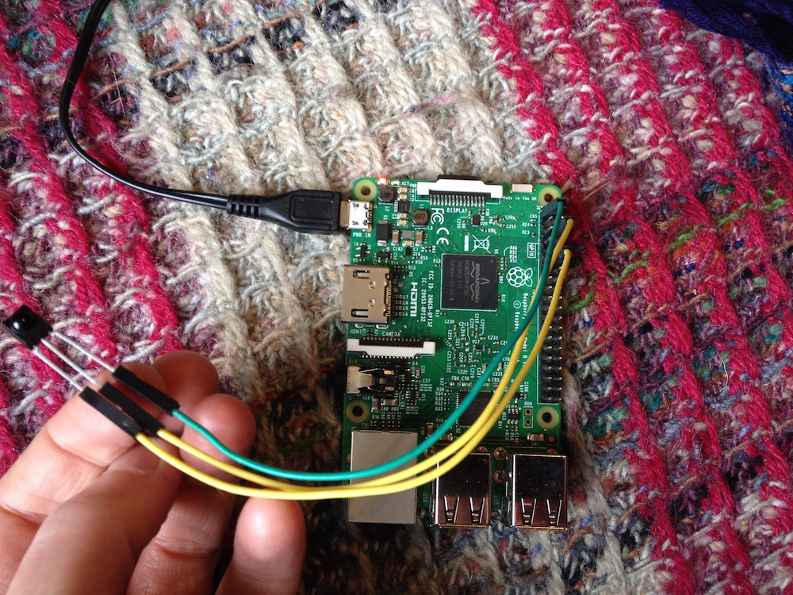
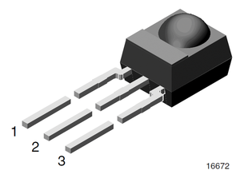

# lirc example

The idea here is to control a chromium webpage via a simple remote control (the usecase I am using it for is full-screen TV-like prototypes). 

## What you need to do

* Gather hardware
* Image an SD card for the Pi
* 

## Hardware

You will need 

* a tiny IR reciever (e.g. 
http://uk.farnell.com/vishay/tsop4838/ir-receiver-38khz/dp/4913190) 
* 3 x female-female jumper wires.
* Raspberry pi 3 (other versions can't manage the chromium + css)
* 2.5 AMP power supply (you might get away with less but this is the offical Pi3 supply requirement)
* 8GB Micro SD card

With the pi switched off, attach the IR receiver as shown:



i.e. in this gpio diagram: https://www.raspberrypi.org/documentation/usage/gpio-plus-and-raspi2/



* GPIO 18 ir (1)
* ground to centre leg (2)
* 3.3V to ir power (3)

## Image a Micro SD card

Download a full Jessie, not lite or NOOBS. I'm asumming 2016-09-23 release and a Pi3.

(N is a number, usually 2 for me)

    diskutil list
    diskutil unmountDisk /dev/diskN
    sudo dd bs=1m if=~/Downloads/2016-09-23-raspbian-jessie.img of=/dev/rdiskN

While the SD card is still in your main machine, in config enable lirc module

    sudo pico /boot/config.txt

Uncomment this to enable the lirc-rpi module

    dtoverlay=lirc-rpi


## Install prerequisites

Login to the pi

    sudo apt-get install lirc #needed ??
    sudo apt-get install xdotool

get this repo

    git clone git@github.com:bbc/lirc-example.git

if you want to record your own remote

    irrecord -d /dev/lirc0 my-remote.lircd

or use the one provided (for an appleTV 2nd gen - silver remote)

    sudo cp lirc-example/lirc/my-remote.lircd /etc/lirc/lircd.conf

    cp lirc-example/lirc/lircrc > /home/pi/.lircrc
    cp -r lirc-example/lirc/keycommands /home/pi/

## Autostart Chromium and LIRCD and a tiny server

    pico ~/.config/lxsession/LXDE-pi/autostart

make the contents of that file run chromium fullscreen on startup:

    @lxpanel --profile LXDE-pi
    @pcmanfm --desktop --profile LXDE-pi
    @xscreensaver -no-splash
    @point-rpi

    @xset s off
    @xset -dpms
    @xset s noblank

    @/usr/bin/chromium-browser --kiosk --disable-infobars --disable-session-crashed-bubble --no-first-run http://localhost:3000

Make the server and irexec run on boot by adding to rc.local

    sudo pico /etc/rc.local

add before ```exit 0```

    cd /home/pi/lirc-example/server && /usr/bin/python -m SimpleHTTPServer 3000 &

    (sleep 3;
    sudo -u pi irexec -d
    )&

## Reboot

It should boot into the tiny python server and you should be able to navigate using the remote.

## Links

lirc

* Testing if remote works: https://discourse.osmc.tv/t/how-to-check-if-the-ir-remote-control-works-gpio/6423/3
* Lirc help:  https://github.com/OpenELEC/OpenELEC.tv/issues/3908
* Best lirc config how to that I found: https://learn.adafruit.com/using-an-ir-remote-with-a-raspberry-pi-media-center/configure-and-test
* More tips: https://wiki.ubuntu.com/LircHowto

xdotool 

* example https://groups.google.com/forum/#!topic/xdotool-users/nKiyg68k9cE

irexec

* http://stackoverflow.com/questions/22423114/cant-get-irexec-to-work-on-rpi
* irexec tips for rc.local https://volumio.org/forum/how-installed-lirc-with-receiver-and-remote-volumio-t360.html
* debugging rc.local https://www.raspberrypi.org/forums/viewtopic.php?f=31&t=49158
